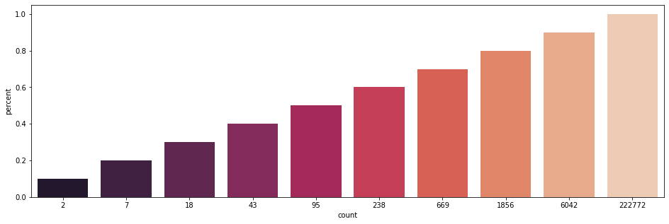
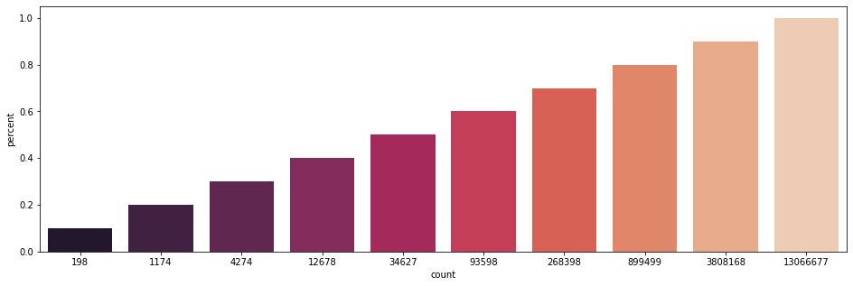
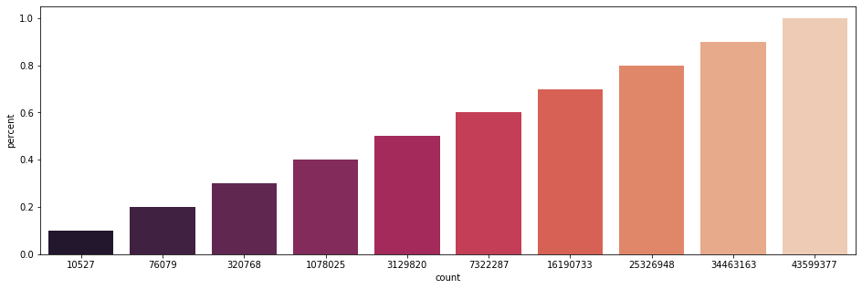

# Milestone Report

Disclosure: I have very little affinity with R and I will probably not use it in the future. Teachers are asking us to take on something we didn't learn before (NLP) so why not using a language we didn't learn before? I will use [Python](https://www.python.org/), the [Spacy](https://spacy.io/) library and other technologies for this capstone.

You will find this notebook with other sources on github: https://github.com/samidarko/datascience-capstone

To store the datasets on Github I used Git Large File Storage https://git-lfs.github.com/


## Imported libraries


```python
import os
import pandas as pd
import numpy as np
import spacy
import seaborn as sns
import matplotlib.pyplot as plt
from collections import Counter
from nltk import bigrams, trigrams
spacy.prefer_gpu()
nlp = spacy.load('en') # loading the english model
```

## Pre-processing
We are going to focus on the english datasets. As the structure of those files are all the same (just lines of text) let's concatenate them in a single file named `corpus.txt` using the following command lines:

```shell
> cat en_US.*.txt > corpus.txt
> wc -l corpus.txt 
 4269678 corpus.txt
```

The file can be found in the project at `datasets/corpus.txt`

We probably only need words so let's keep only alpha tokens in lowercase. 

We will use [spacy](https://spacy.io/) for the purpose. Like, it takes resources I will store the result in a new file named `preprocessed_corpus.csv`


```python
if not os.path.isfile('datasets/preprocessed_corpus.txt'):
    with open('datasets/corpus.txt') as corpus:
        with open('datasets/preprocessed_corpus.txt', 'w') as preprocessed_corpus:
            for line in corpus.readlines():
                preprocessed_corpus.write('{}\n'.format(','.join([token.lower_ for token in nlp(line.strip()) if token.is_alpha])))
```

### Monogram frequencies
As our `preprocessed_corpus.csv` contains more than 4 millions lines, we do not want to extract the monogram frequencies every time we run this cell, so we are going to store this result in a new dataset named `monogram_frequencies.txt`


```python
if not os.path.isfile('datasets/monogram_frequencies.txt'):
    words_count = Counter()
    for line in open('datasets/preprocessed_corpus.txt').readlines():
        words_count += Counter(line.strip().split(','))
        
    with open('datasets/monogram_frequencies.txt', 'w') as f:
        for word, count in words_count.most_common():
            f.write('{},{}\n'.format(word, count))
```

### Bigram frequencies


```python
if not os.path.isfile('datasets/bigram_frequencies.txt'):
    words_count = Counter()
    for line in open('datasets/preprocessed_corpus.txt').readlines():
        words = line.strip().split(',')
        words_count += Counter([' '.join(ngram) for ngram in bigram(words)])
        
    with open('datasets/bigram_frequencies.txt', 'w') as f:
        for word, count in words_count.most_common():
            f.write('{},{}\n'.format(word, count))
```

### Trigram frequencies


```python
if not os.path.isfile('datasets/trigram_frequencies.txt'):
    words_count = Counter()
    for line in open('datasets/preprocessed_corpus.txt').readlines():
        words = line.strip().split(',')
        words_count += Counter([' '.join(ngram) for ngram in trigram(words)])
        
    with open('datasets/trigram_frequencies.txt', 'w') as f:
        for word, count in words_count.most_common():
            f.write('{},{}\n'.format(word, count))
```

### A more scalable approach
The code above is just a naive approach and would take a lot of time. What I actually did is split the data into 6 smaller datasets:

```shell
> split -l 711613 preprocessed_corpus.txt
```

We now have 6 files: `xaa`, `xab`, `xac`, `xad`, `xae` and `xaf` of 711613 lines of text

I opened 6 terminals and in each I ran the python script `monogram_counter.py` provided in the repository with each of the `xa?`

```shell
> python monogram_counter.py datasets/xaa
```

After each processed ended I ran the aggregator script:
```shell
> python counter_aggregator.py datasets/monogram_frequencies.txt datasets/xa*.csv
```

I did the same to generate `bigram_frequencies.txt` and `trigram_frequencies.txt` using another script `python ngram_counter.py 2 datasets/xaa` and `python ngram_counter.py 2 datasets/xaa` respectfully. Also provided in repository.

## Exploratory analysis

### The aggregated corpus


```python
monogram_frequencies_df = pd.read_csv('datasets/monogram_frequencies.txt', names=['ngram', 'frequency'])
print('The corpus contains {} unique words'.format(monogram_frequencies_df.ngram.count()))
print('The corpus contains a total of {} words'.format(monogram_frequencies_df.frequency.sum()))
```

    The corpus contains 222773 unique words
    The corpus contains a total of 29225076 words


The corpus contains 4269678 lines:
```shell
> wc -l datasets/corpus.txt 
4269678 datasets/corpus.txt
```

### What are the frequencies of 1-gram, 2-grams and 3-grams in the dataset? 


```python
monogram_frequencies_df.head(10)
```


<div>
<style scoped>
    .dataframe tbody tr th:only-of-type {
        vertical-align: middle;
    }

    .dataframe tbody tr th {
        vertical-align: top;
    }

    .dataframe thead th {
        text-align: right;
    }
</style>
<table border="1" class="dataframe">
  <thead>
    <tr style="text-align: right;">
      <th></th>
      <th>ngram</th>
      <th>frequency</th>
    </tr>
  </thead>
  <tbody>
    <tr>
      <td>0</td>
      <td>the</td>
      <td>1471219</td>
    </tr>
    <tr>
      <td>1</td>
      <td>and</td>
      <td>863749</td>
    </tr>
    <tr>
      <td>2</td>
      <td>to</td>
      <td>845783</td>
    </tr>
    <tr>
      <td>3</td>
      <td>i</td>
      <td>713032</td>
    </tr>
    <tr>
      <td>4</td>
      <td>a</td>
      <td>710149</td>
    </tr>
    <tr>
      <td>5</td>
      <td>of</td>
      <td>692803</td>
    </tr>
    <tr>
      <td>6</td>
      <td>in</td>
      <td>473068</td>
    </tr>
    <tr>
      <td>7</td>
      <td>it</td>
      <td>383436</td>
    </tr>
    <tr>
      <td>8</td>
      <td>that</td>
      <td>383327</td>
    </tr>
    <tr>
      <td>9</td>
      <td>is</td>
      <td>350925</td>
    </tr>
  </tbody>
</table>
</div>


```python
bigram_frequencies_df = pd.read_csv('datasets/bigram_frequencies.txt', names=['ngram', 'frequency'])
bigram_frequencies_df.head(10)
```


<div>
<style scoped>
    .dataframe tbody tr th:only-of-type {
        vertical-align: middle;
    }

    .dataframe tbody tr th {
        vertical-align: top;
    }

    .dataframe thead th {
        text-align: right;
    }
</style>
<table border="1" class="dataframe">
  <thead>
    <tr style="text-align: right;">
      <th></th>
      <th>ngram</th>
      <th>frequency</th>
    </tr>
  </thead>
  <tbody>
    <tr>
      <td>0</td>
      <td>of the</td>
      <td>431854</td>
    </tr>
    <tr>
      <td>1</td>
      <td>in the</td>
      <td>412436</td>
    </tr>
    <tr>
      <td>2</td>
      <td>to the</td>
      <td>214324</td>
    </tr>
    <tr>
      <td>3</td>
      <td>for the</td>
      <td>201268</td>
    </tr>
    <tr>
      <td>4</td>
      <td>on the</td>
      <td>197424</td>
    </tr>
    <tr>
      <td>5</td>
      <td>to be</td>
      <td>162677</td>
    </tr>
    <tr>
      <td>6</td>
      <td>at the</td>
      <td>143426</td>
    </tr>
    <tr>
      <td>7</td>
      <td>and the</td>
      <td>126317</td>
    </tr>
    <tr>
      <td>8</td>
      <td>in a</td>
      <td>120234</td>
    </tr>
    <tr>
      <td>9</td>
      <td>with the</td>
      <td>106049</td>
    </tr>
  </tbody>
</table>
</div>


```python
trigram_frequencies_df = pd.read_csv('datasets/trigram_frequencies.txt', names=['ngram', 'frequency'])
trigram_frequencies_df.head(10)
```


<div>
<style scoped>
    .dataframe tbody tr th:only-of-type {
        vertical-align: middle;
    }

    .dataframe tbody tr th {
        vertical-align: top;
    }

    .dataframe thead th {
        text-align: right;
    }
</style>
<table border="1" class="dataframe">
  <thead>
    <tr style="text-align: right;">
      <th></th>
      <th>ngram</th>
      <th>frequency</th>
    </tr>
  </thead>
  <tbody>
    <tr>
      <td>0</td>
      <td>one of the</td>
      <td>34625</td>
    </tr>
    <tr>
      <td>1</td>
      <td>a lot of</td>
      <td>30044</td>
    </tr>
    <tr>
      <td>2</td>
      <td>thanks for the</td>
      <td>23835</td>
    </tr>
    <tr>
      <td>3</td>
      <td>to be a</td>
      <td>18220</td>
    </tr>
    <tr>
      <td>4</td>
      <td>going to be</td>
      <td>17449</td>
    </tr>
    <tr>
      <td>5</td>
      <td>i want to</td>
      <td>15208</td>
    </tr>
    <tr>
      <td>6</td>
      <td>the end of</td>
      <td>14986</td>
    </tr>
    <tr>
      <td>7</td>
      <td>out of the</td>
      <td>14947</td>
    </tr>
    <tr>
      <td>8</td>
      <td>it was a</td>
      <td>14874</td>
    </tr>
    <tr>
      <td>9</td>
      <td>as well as</td>
      <td>13943</td>
    </tr>
  </tbody>
</table>
</div>


### How many unique words do you need in a frequency sorted dictionary to cover all word instances in percent


```python
def get_cumulated_ngram_count_in_percent(df):
    total_ngrams = df.frequency.sum()
    df['coverage'] = df.frequency / total_ngrams
    df['coverage_cumsum'] = df.coverage.cumsum()
    percents = np.arange(0.1, 1.1, 0.1)
    cumulated_ngram_count = []
    for percent in percents:
        cumulated_ngram_count.append(df[df.coverage_cumsum <= percent]['ngram'].count())
    return pd.DataFrame({'percent': percents, 'count': cumulated_ngram_count})
```


```python
plt.figure(figsize=(16, 5))
sns.barplot(x='count', y='percent', data=get_cumulated_ngram_count_in_percent(monogram_frequencies_df), palette="rocket")
```


    <matplotlib.axes._subplots.AxesSubplot at 0x121704a90>





```python
plt.figure(figsize=(16, 5))
sns.barplot(x='count', y='percent', data=get_cumulated_ngram_count_in_percent(bigram_frequencies_df), palette="rocket")
```


    <matplotlib.axes._subplots.AxesSubplot at 0x121c00b90>





```python
plt.figure(figsize=(16, 5))
sns.barplot(x='count', y='percent', data=get_cumulated_ngram_count_in_percent(trigram_frequencies_df), palette="rocket")
```


    <matplotlib.axes._subplots.AxesSubplot at 0x121b0ae90>





### How do you evaluate how many of the words come from foreign languages?
- Use a static dictionary
- Test if the characters belong the the alphabet

## Modeling
We can have two naive models one when passing a monogram and another when passing a bigram


```python
one_word_model = pd.DataFrame(bigram_frequencies_df.ngram.apply(lambda x: tuple(x.split(' '))).values.tolist(), columns=['ngram', 'next_word'])
```


```python
def two_word_model_transform(value):
    a, b, c = value.split(' ')
    return ('{} {}'.format(a, b), c)

two_words_model = pd.DataFrame(trigram_frequencies_df.ngram.apply(two_word_model_transform).values.tolist(), columns=['ngram', 'next_word'])
```


```python
one_word_model[one_word_model.ngram == 'the'].next_word
```


    41                  first
    49                   same
    74                   best
    88                  world
    96                    new
                    ...      
    13065807           asspen
    13066154             anit
    13066399        auslander
    13066463    bestmovieever
    13066540       dailygrape
    Name: next_word, Length: 105550, dtype: object


```python
two_words_model[two_words_model.ngram == 'the best'].next_word
```


    495                   of
    888                  way
    1464               thing
    2032                part
    2532                  in
                    ...     
    43491086     conditioner
    43491087    skateboarder
    43491088          zeldas
    43510300        frosting
    43535500        hardcore
    Name: next_word, Length: 5432, dtype: object


Later I will refine this model to make them faster


```python

```
